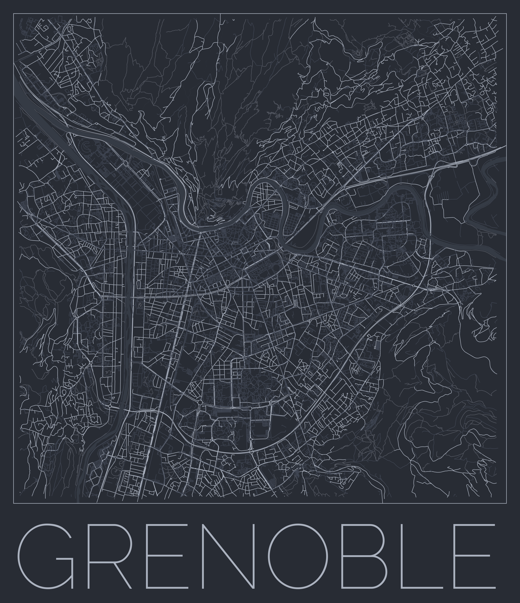

# PrettyOSMRenderer

## Requirements

- Python 3.10 (will likely work with >=3.8 but untested)
- [osmnx](https://osmnx.readthedocs.io/en/stable/)
- [geopandas](https://geopandas.org/en/stable/docs.html) 
- [geopy](https://geopy.readthedocs.io/en/stable/)
- [pillow](https://pillow.readthedocs.io/en/stable/)

## Usage

Two tools are provided:

### For generating high resolution maps:

The `generate_map.py` program is used to generate high resolution maps of an area. See `generate_map.py --help` for addition help:

```
usage: generate_map.py [-h] [--place PLACE] [--radius RADIUS] [--palette_file PALETTE_FILE] [--palette_names PALETTE_NAMES [PALETTE_NAMES ...]] [--export_dir EXPORT_DIR]

options:
  -h, --help            show this help message and exit
  --place PLACE         The place to generate the map for
  --radius RADIUS       Radius around the point to generate
  --palette_file PALETTE_FILE
                        Path to a json file containing colour palettes
  --palette_names PALETTE_NAMES [PALETTE_NAMES ...]
                        Names of the palettes to load from the palette_file
  --export_dir EXPORT_DIR
                        Path to a directory in which to place the generated maps
```
### For formatting high resolution maps and adding nice metadata:

The `add_text.py` program is used to modify high resolution maps of an area, adding a border as well as the mapped place name. This tool also generated a lower resolution image (downscaled to a maximum width/height of 1920px) which is useful for sharing online. See `add_text.py --help` for addition help:

```
usage: add_text.py [-h] --image IMAGE [IMAGE ...] [--palette_file PALETTE_FILE] [--palette PALETTE] [--export_dir EXPORT_DIR]

options:
  -h, --help            show this help message and exit
  --image IMAGE [IMAGE ...]
                        Path to the images to process
  --palette_file PALETTE_FILE
                        Path to a json file containing colour palettes
  --palette PALETTE     Names of the palette to load from the palette_file
  --export_dir EXPORT_DIR
                        Path to a directory in which to place the generated maps
```

## Result

Formatted map of Grenoble using the One Dark colour scheme:

